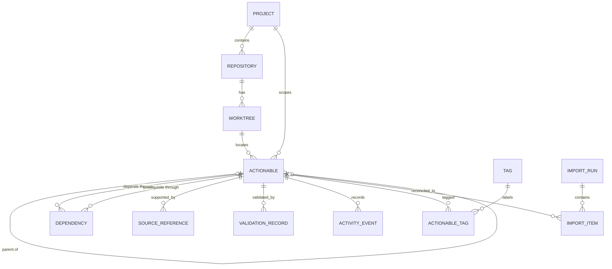

# Personal actionables dashboard product and implementation plan

## Outcome

A local, single-user web application can be implemented without redesigning the product, data model, architecture, or approved visual system. The application organizes technical actionables by project and worktree, preserves traceability to Codex findings and repository evidence, distinguishes subtasks from dependencies, and requires explicit validation before completion. Before backend work, a frontend-only checkpoint must match the authoritative Actionables reference and receive user approval.

## Execution

- Mode: Supervised
- Task execution: Inline

## Global constraints

- The current checkpoint authorizes only T-003. Do not implement dashboard/archive behavior, general import/export UI, authentication, T-005 or later-slice behavior, and do not mutate the representative `WWW` repository.
- Initial use is local and single-user. Do not add authentication, accounts, permissions, collaboration, notifications, cloud infrastructure, or synchronization.
- Optimize for long, technical, Markdown-heavy findings and a dense desktop workflow; mobile is a usable companion, not the primary authoring surface.
- Preserve hierarchy and dependency as separate relationships with separate rules and UI.
- Preserve source wording and evidence. Imported inferences must be visibly labeled and must not silently become facts.
- Prefer established platform behavior and a small dependency set. Defer graph canvases, real-time integration, and speculative enterprise abstractions.
- The user requested a plan-only commit before implementation and a focused T-004 implementation commit after validation.

## Research

### Research scope and provenance

- Instructions and source-of-truth artifacts: original request at `C:\Users\AustinScriver\.codex\attachments\5b7f9c17-2096-4c59-8d16-1d53b35e624c\pasted-text.txt`; visual checkpoint request at `C:\Users\AustinScriver\.codex\attachments\cada2552-ec51-48f9-979e-b6f266dca3c4\pasted-text.txt`; authoritative image at `C:\Users\AUSTIN~1\AppData\Local\Temp\codex-clipboard-332b171a-fa1d-4eed-816b-d58557c8faf6.png`; representative task `codex://threads/019f9512-b95f-70e3-ac12-36fda6c6e69f`.
- Commands and searches: inspected the dashboard project root and Git status; read the task through the Codex task API; located and inspected its untruncated local transcript; reviewed current official documentation for React, Vite, React Router, Fastify, Node.js, Prisma, Drizzle, TanStack Query, Vitest, Playwright, Tailwind CSS, and SQLite.
- Scope inspected and files read fully: the attached request, this repository root, the relevant task messages, and the planning/visualization skill instructions.
- Tests, configuration, documentation, history, memory, or external sources: current official product documentation linked in the technology evaluation below. No application tests exist because the repository is empty and implementation is out of scope.
- Meaningful not-found evidence: the dashboard repository contains only `.git`; there is no existing application, package manifest, schema, or project convention to preserve.

### Confirmed facts

- The representative task is accessible and is titled “Assess project architecture and risk.” It reviewed `C:\repos\MyStotz2023\Projects\WWW`.
- Its follow-up response contains 32 copy/paste-ready actionables grouped into correctness/security, reliability, testing, performance, maintainability/developer experience, and observability/operations.
- A representative actionable can contain a multi-paragraph description, multiple file and symbol references, a confidence statement, an effort range, and three to five validation bullets.
- Evidence can span repository layers and non-code artifacts. Examples include `Startup.cs`, MVC controllers, Razor views, shared service/data projects, test projects, `global.json`, publish profiles, and Azure DevOps pipeline YAML.
- Source findings distinguish confirmed problems, confirmed technical limitations whose production impact still requires measurement, proposed coverage, suspicions requiring investigation, and pure investigations.
- Some relationships are explicit in the source. For example, post-deployment smoke checks say they follow health endpoints, and browser coverage says it follows the underlying protected-download and polling fixes. Other plausible relationships are only inferred.
- The source does not explicitly define projects, repositories, worktrees, tags, parent/child relationships, or normalized statuses. These must be added through import mapping and triage, not presented as source facts.
- The authoritative image is 1586×990 and defines an approximately 244 px / 869 px / 473 px three-pane split (15% / 55% / 30%), a roughly 49 px top bar, and roughly 43 px actionable rows.
- The authoritative visual system is near-black/charcoal with subtle surface differences, fine gray separators, off-white/muted-gray type, cyan selection/action accents, compact rectangular badges, small radii, and almost no shadow.
- The image is authoritative for layout and appearance; its placeholder finding content is not. The referenced Codex task remains authoritative for actionable content.

### Reasoned conclusions

- The product is not a general task manager. Its differentiator is turning long technical evidence into a bounded next action while retaining provenance, research state, dependency logic, and validation.
- “Actionables” should be the primary interface. It best supports repeated scanning, prioritization, editing, and keyboard use. “Workbench” and “Signal” are useful secondary ideas, not primary navigation models.
- Repository deserves its own small entity between Project and Worktree because source references and worktree paths refer to a repository even when the user navigates primarily by project/worktree.
- Imported source priority and effort should be normalized for filtering while retaining the original text in the import record.
- Initial hierarchy should allow one parent plus one child level. This covers review-area-to-fix slices without imposing arbitrary tree navigation or recursive drag/drop on the first release.
- Dependencies may cross project, repository, and worktree boundaries. Hierarchy may not: parent and child must share project and worktree.
- Completion should require passed validation or an explicit override reason. Otherwise “Done” loses the distinction between intended work and verified work that the source material consistently preserves.

### Assumptions and evidence gaps

- Assumption: this is a browser application served locally on Windows, not an Electron application.
- Assumption: one logical project may eventually contain more than one repository, even though the seed source maps naturally to one repository and one worktree.
- Assumption: hundreds or a few thousand actionables are a realistic local scale; full-text search and list virtualization are not initially necessary.
- Gap requiring later verification: `codex://` task resolution and the task-reading capability available to Codex are not established as a public API that this application can call.
- Gap requiring later verification: a stable, machine-readable Codex export format and stable response/section identifiers are not established.
- Gap requiring implementation-time verification: package versions and Node compatibility must be pinned from stable release channels when scaffolding begins.

### Approved decisions

- The attached Actionables image is the authoritative MVP visual specification.
- The MVP uses the reference’s dense desktop productivity shell: narrow project/worktree sidebar, dominant issue table, persistent right inspector, and compact integrated top bar.
- Alternative visual directions, generic dashboard templates, card grids, kanban, glassmorphism, gradients, and oversized dashboard statistics are out of scope.
- The user approved the rendered T-000 desktop, laptop, and mobile screenshots as the MVP visual baseline on 2026-07-24.
- The user approved proceeding with the selected Node/React/Fastify/Prisma/SQLite architecture for T-001.
- Preserve the approved `MyStotz2023` / `CurrentSprint` scope labels for the architecture proof.

### Decision gates

- Resolved 2026-07-24: the frontend checkpoint was rendered, compared, corrected, and explicitly approved. T-001 is authorized.
- Resolved 2026-07-24: the user approved the corrected T-004-before-T-003 execution order, explicit lifecycle transition matrix, and updated task authorities. T-004 is authorized.
- Resolved 2026-07-24: the user approved T-004 and authorized T-003 hierarchy/dependency implementation, a focused T-003 commit, and a stop before T-005.

## 1. Product definition

### Primary purpose

Turn actionable findings from Codex work into a trusted personal execution queue: scoped to the real project and worktree, connected to evidence, decomposed when necessary, ordered by dependencies, and closed only with validation.

### Target user and usage pattern

The primary user is a developer who runs multiple technical Codex sessions across repositories and worktrees. Expected use is several short desktop sessions per day:

1. Import or capture findings.
2. Triage the inbox into real actionables.
3. Choose work that is ready and unblocked.
4. Add research while investigating.
5. Record implementation progress and validation.
6. Revisit the original thread, file, symbol, or command when context is needed.

Mobile use is for review, quick triage, status updates, and reading evidence. Dense research editing and dependency management remain desktop-first.

### Core jobs

- Convert a finding into a bounded change with a clear next step.
- See what is ready, what is manually blocked, and what is blocked by another actionable.
- Keep broad review findings and their concrete fix slices connected without confusing containment with execution order.
- Preserve the exact thread, repository, file, symbol, line, commit, command, or URL that supports a finding.
- Separate what was explicitly found from what the importer or user inferred.
- Capture research without losing the original finding.
- Define and record how completed work was validated.
- Resume work after days or across worktrees without rereading an entire Codex task.

### What makes an item actionable

An actionable is more than a note when it has:

- a concise outcome-oriented title;
- a project and worktree scope;
- a finding or problem statement;
- a description of the intended result or next bounded investigation;
- a priority and workflow status;
- at least one validation plan or an explicit statement that validation still needs definition;
- enough evidence or source context to resume the work.

An imported finding that lacks scope or an intended outcome remains in `Inbox` with `needs triage`. A source excerpt may exist without an actionable; it becomes actionable only after the minimum fields above are resolved.

### MVP boundaries

The MVP includes:

- local single-user operation with no sign-in;
- project, repository, and worktree setup;
- actionable CRUD for every requested field;
- one-level subtasks;
- cross-scope dependencies with cycle prevention and derived blocking;
- source references and import provenance;
- research notes and validation records;
- statuses, dismissal, reopening, and independent archival;
- dashboard, dense list, detail inspector, filters, sorting, and basic text search;
- activity history for meaningful state changes;
- idempotent JSON import with preview and full JSON export;
- a curated seed import for all 32 representative `WWW` actionables;
- responsive mobile views and baseline keyboard/accessibility support.

### Non-goals

- Collaboration, assignment, comments, mentions, accounts, permissions, notifications, due dates, sprints, estimates in hours, billing, calendars, or generic project-management features.
- Live Git status, branch management, source editing, running Codex, executing validation commands, or changing repositories.
- Automated parsing of arbitrary natural-language threads with no review.
- A full spatial canvas, Gantt chart, kanban board, or global chronological feed in the MVP.
- Authentication, hosted deployment, cloud sync, offline conflict resolution, or multi-user concurrency.
- AI prioritization or automatic dependency creation.

## 2. Interface direction

The attached **Actionables** image is authoritative. Do not explore or substitute another visual direction.

- The main screen closely reproduces its project/worktree navigator, compact findings table, and persistent detail inspector.
- The inspector’s primary tabs are `Finding`, `Research notes`, and `Validation`, with a thin cyan active indicator.
- Subtasks, `Blocked by`, `Blocks`, source history, and activity/history extend the inspector as compact native sections rather than new cards or a spatial canvas.
- The center findings table remains the visually dominant workspace.
- Global Workbench and Signal surfaces remain deferred; relationship and source/history information is incorporated only where the reference can absorb it without changing character.

## 3. Information architecture

### Primary navigation

1. **Dashboard** — work needing a decision or action.
2. **Inbox** — imported or manually captured findings that need triage.
3. **Actionables** — the primary dense list.
4. **Projects** — project/repository/worktree management and scoped rollups.
5. **Archive** — archived scopes and actionables.
6. **Data** — import preview, import history, export, and local backup guidance.

Do not add Settings as a permanent top-level destination until a real preference exists.

### Project and worktree organization

```text
Project: MyStotz / WWW review
└── Repository: MyStotz2023
    ├── Worktree: CurrentSprint
    └── Worktree: another checked-out branch
```

- Project is the user-facing planning container.
- Repository identifies the source repository and optional remote.
- Worktree identifies a concrete checkout path and optional branch/commit snapshot.
- An actionable belongs to one project and one worktree. Its source references may point to other repositories or historical paths.
- “All worktrees” is a scope filter, not a synthetic worktree.

### Main views

**Dashboard**

- Needs triage.
- Ready and unblocked.
- In progress.
- Dependency blocked.
- Manually blocked.
- Done but missing/failed validation is not possible; instead show “validation required” before completion.
- Recently updated and recently imported.

These are actionable queues, not vanity totals.

**Actionables workspace**

- Left: project/repository/worktree tree plus saved system scopes.
- Center: dense list with priority, status, title, effort, dependency state, tags, and updated time.
- Right: inspector for the selected actionable.
- Selection is reflected in the URL so refresh and deep links preserve context.

**Full actionable route**

- Used on mobile and when the user expands the inspector.
- Same content and actions as the inspector; no separate behavior model.

**Project view**

- Project metadata, repositories/worktrees, unresolved counts, recent imports, and archive controls.

**Data view**

- Choose a supported JSON file.
- Preview inserts, updates, unchanged items, warnings, and conflicts.
- Commit the import explicitly.
- Export a complete portable snapshot.

### Archival behavior

- Archival is independent of workflow status and is reversible.
- Archiving a project or worktree hides its descendants from default navigation but does not change descendant statuses or set their individual `archivedAt`.
- Before archiving a project/worktree with unresolved actionables, show a count and require confirmation.
- Deep links to items in archived scopes still work and show an archived-scope banner.
- Archiving an actionable hides it from active queues; dependencies to it remain visible and unresolved unless the edge is waived or removed.
- Archive views can restore the exact entity without reconstructing relationships.

### Movement between evidence and work

- Source reference → opens its actionable in the inspector and highlights the reference.
- Actionable → Sources section opens a `codex://` URI, file path, commit URL, or web URL when the environment supports it; otherwise copy the locator.
- Parent → child uses an inline subtask list and breadcrumb.
- Dependency → opens the related actionable without losing the current filtered list; Back returns to the original item.
- Activity entries link to the affected validation, dependency, source, or imported version.

## 4. Workflow definitions

### Capture or import

1. Manual capture creates an `Inbox` actionable.
2. File import runs a dry preview.
3. The preview labels explicit fields, normalized values, and inferred suggestions.
4. Commit creates or reconciles items in one transaction.
5. Imported actionables retain source thread URI, response/item identifier when available, raw source fragment, source ordinal, import key, and content hash.

### Triage

Triage resolves:

- project, repository, and worktree;
- outcome-oriented title;
- priority;
- evidence state;
- likely effort range;
- tags;
- whether the item is actionable now, needs research, or should be dismissed;
- suggested hierarchy/dependencies.

Leaving triage changes `Inbox` to `Researching` or `Ready`. An item cannot become `Ready` without a worktree, finding/description, and validation plan.

### Research

- Set status to `Researching`.
- Append or edit Markdown research notes.
- Add source references and distinguish `explicit`, `user-added`, and `inferred`.
- Record open questions as checkable research bullets inside notes; do not create a separate generic checklist entity in MVP.
- When evidence is sufficient, revise the description/validation plan and move to `Ready`.

### Plan and execute

- `Ready` means triaged and not manually blocked; dependency blocking is derived separately.
- Starting work moves the item to `In progress`.
- The UI warns before starting an item with incomplete dependencies and requires either resolving/waiving them or an explicit override note.
- Subtasks can be created from the parent. Parent progress is derived as completed children / total children.
- A parent cannot be completed until every child is `Done` or `Dismissed`.

### Blockers and dependencies

Store status and dependency state separately:

- `status = Blocked` means the user manually selected it and must provide a blocker note.
- `isDependencyBlocked = true` is derived when at least one active `depends on` edge targets an actionable that is not `Done`.
- `isEffectivelyBlocked = status == Blocked OR isDependencyBlocked`.
- UI labels are distinct: **Blocked — manual** and **Blocked by 2 dependencies**.
- A dismissed prerequisite does not satisfy a dependency. Remove or waive the edge with a reason.
- A waived edge remains in history and no longer contributes to derived blocking.

The stored edge reads: `dependent actionable depends on prerequisite actionable`. The reverse “blocks” wording is derived.

### Validate and complete

1. Add one or more validation records containing method, optional command, result, summary, evidence, and timestamp.
2. `Done` requires at least one passed validation created after the latest move into `In progress`, or a completion override with a required reason.
3. Failed or partial validation leaves the item non-Done and visible in the validation section.
4. Completing a parent also requires all children terminal.
5. Completion records an activity event with the validation/override used.

### Dismiss, reopen, archive

- Dismiss requires a reason and means “no longer intended,” not “verified complete.”
- Reopen moves `Done` or `Dismissed` to `Ready` by default and records the reason.
- Reopening a child automatically reopens a completed parent to `Ready` in the same transaction.
- Archive only changes visibility.
- Restore returns the item to its previous status and relationships unchanged.

### MVP workflow status model and transition matrix

The persisted workflow statuses are `Inbox`, `Researching`, `Ready`, `In progress`, `Blocked`, `Done`, and `Dismissed`. Archive is independent visibility state, not a workflow status. Dependency blocking is derived separately and never changes the persisted workflow status automatically.

| From | Allowed persisted status targets | Owner and guard |
| --- | --- | --- |
| `Inbox` | `Researching`, `Ready`, `Dismissed` | T-002 owns `Researching`/`Ready`; T-004 adds dismissal with a required reason |
| `Researching` | `Inbox`, `Ready`, `Blocked`, `Dismissed` | T-002 owns `Inbox`/`Ready`; T-004 adds manual blocking and dismissal |
| `Ready` | `Inbox`, `Researching`, `In progress`, `Blocked`, `Dismissed` | T-002 owns `Inbox`/`Researching`; T-004 adds execution, manual blocking, and dismissal |
| `In progress` | `Ready`, `Blocked`, `Done`, `Dismissed` | T-004; `Done` requires qualifying validation or an override reason |
| `Blocked` | `Researching`, `Ready`, `In progress`, `Dismissed` | T-004; entry requires a blocker note and exit records the explicit destination |
| `Done` | `Ready` | T-004 core reopen; requires a reason |
| `Dismissed` | `Ready` | T-004 core reopen; requires a reason |

Additional relationship rules belong to T-003 and consume this lifecycle model: only a `Done` prerequisite satisfies an active dependency; a dismissed prerequisite remains unsatisfied; parent completion also requires every child to be `Done` or `Dismissed`; and reopening a child automatically reopens a completed parent to `Ready` in the same transaction. T-003 does not introduce statuses or general lifecycle transitions.

## 5. Feature inventory

### Required MVP

| Feature | User problem solved |
| --- | --- |
| Project/repository/worktree scopes | Keeps findings tied to the checkout where the work is meaningful |
| Dense list + inspector | Makes long technical work scannable without losing detail |
| All requested actionable fields with Markdown | Preserves the source’s real technical depth |
| Evidence-state field | Prevents a suspicion or proposed test from being shown as a confirmed defect |
| One-level subtasks | Breaks broad audits into concrete slices without tree complexity |
| Cross-scope dependencies | Shows actual execution order even across worktrees |
| Manual vs derived blocking | Prevents dependency logic from overwriting the user’s workflow intent |
| Source references | Makes every task resumable from its evidence |
| Validation records and completion gate | Distinguishes “changed” from “proved” |
| Activity history | Explains how an imported finding became the current task |
| Dashboard queues | Answers what needs triage or can be worked now |
| Search/filter/sort with URL state | Supports repeatable daily views and deep links |
| Archive/restore | Reduces noise without destroying traceability |
| Previewed idempotent JSON import/export | Seeds real data safely and provides a portable backup |
| Responsive and keyboard-accessible behavior | Keeps quick review usable away from the primary desktop |

### Next release

| Feature | User problem solved |
| --- | --- |
| Source sessions view | Groups imported actionables back into the Codex session that produced them |
| Compact one-hop dependency graph | Makes a selected blocker neighborhood easier to understand |
| Saved filters | Preserves repeated personal workflows after real filter patterns emerge |
| Bulk triage for priority/tags/scope | Reduces repetitive cleanup after large imports |
| Import three-way field reconciliation UI | Resolves changed source content versus local edits safely |
| Full-text search with SQLite FTS5 | Keeps search fast if the database grows beyond simple `LIKE` queries |
| Local path remapping | Keeps historical source paths useful after moving a repository |
| Optional validation templates | Reuses recurring validation shapes only after repetition is observed |

### Longer-term ideas

| Feature | User problem solved |
| --- | --- |
| Verified Codex integration | Removes manual export only if a stable supported interface exists |
| Global Workbench graph | Explores large cross-project dependency networks if list navigation becomes inadequate |
| Global Signal timeline | Reviews activity across sessions if per-item history is insufficient |
| Hosted multi-device deployment | Provides access beyond one machine when that need becomes real |
| Git/commit association | Connects completed actionables to implementation evidence without turning the app into a Git client |
| Automated stale-source checks | Identifies line/path drift after enough real source references accumulate |

Explicitly excluded unless a new user problem appears: assignees, team roles, notifications, comments, reactions, sprint ceremonies, time tracking, and generic kanban.

## 6. UX specification

### Desktop shell

- Reference viewport: 1586×990.
- Left rail: approximately 15% (244 px at reference width), minimum 210 px, collapsible.
- Center list: approximately 55% (869 px at reference width), dominant and flexible.
- Inspector: approximately 30% (473 px at reference width), resizable and hideable within limits.
- Top bar: 48–52 px and visually continuous across the center/right panes.
- Table rows: 40–44 px; target 43 px at the reference viewport.
- Top bar contains project/worktree selectors, centered global search, one cyan `New actionable` action, Filters, and compact icon actions.
- Avoid modal editing for long fields. Edit in the inspector/full page with explicit Save/Cancel and unsaved-change protection.

### Mobile behavior

- Below 760 px, use one routed pane at a time: navigation → list → detail.
- Preserve filters and list scroll when returning from detail.
- Use a compact sticky action row for status, edit, and relationship actions.
- Render dependencies and subtasks as lists; omit graph mode.
- Markdown fields remain readable and editable, but tables/code may scroll horizontally within their own region.

### Actionable list

Columns on desktop:

1. finding/title;
2. priority;
3. status;
4. worktree;
5. likely effort;
6. updated time.

Behavior:

- Single click selects and opens inspector.
- Enter opens full detail; Space toggles selection only if bulk actions are later added.
- Default sort: priority ascending (`P0` first), effective readiness, then updated descending.
- No drag reordering in MVP; priority/status are explicit fields.
- Parent rows show child progress. Child rows are visually indented only when a parent is expanded.
- Dependency blocked is a compact icon/label alongside the finding or status; full relationship information stays in the inspector.
- Header remains visible during list scrolling; columns remain aligned and long titles truncate.
- Selected row uses a thin cyan outline/accent. Hover is a restrained surface change.
- Footer/status strip shows visible/selected item counts.

### Actionable detail

Header:

- title, priority, status, effort, project/worktree, tags;
- separate manual/dependency blocker badges;
- Save, archive, and overflow actions.

Primary tabs:

1. Finding
2. Research notes
3. Validation

The Finding tab contains the description and compact file/symbol reference rows. Research notes render readable Markdown. Validation renders a checklist or structured procedure. Subtasks, `Blocked by`, `Blocks`, source thread/history, and activity appear as restrained sections within the relevant tab or below its core content. Long sections may collapse, but the chosen state is local UI state rather than domain data.

### Authoritative visual tokens

- Surfaces: near-black application background with subtle charcoal pane variation.
- Borders: 1 px low-contrast gray dividers; no heavy outlines except the cyan selected-row state.
- Primary text: off-white; secondary text: muted gray.
- Accent: cyan for selection, active tabs, branch status, links, focus, and the primary action.
- Priority: burnt red/orange for high, amber for medium, muted blue-gray for low.
- Status: blue for in progress, purple for review/validation, neutral charcoal for open/ready.
- Typography: compact sans-serif for interface text; monospace only for paths, branches, commits, symbols, and identifiers.
- Geometry: small radii, 4–8 px spacing increments, 43 px table rows, 48–52 px top bar, little or no shadow.
- Motion: brief restrained hover/focus/tab transitions; no decorative animation.
- Tokens must cover colors, surfaces, borders, typography, spacing, row heights, pane widths, radii, focus/hover/selected states, and responsive breakpoints.

### Subtasks

- Add from the parent in context.
- New child inherits project/worktree and may inherit tags only when the user selects that option.
- Parent and child show reciprocal navigation.
- Moving an existing item under a parent requires confirmation and rule validation.
- No child may have children in MVP.

### Dependencies

- “Depends on” editor searches all non-archived actionables, including other projects/worktrees.
- Each search result shows project/worktree to avoid same-title mistakes.
- Relationship section has two lists: `Depends on` and `Blocks`.
- Adding an edge previews any resulting block and rejects self/circular edges with a plain-language path, for example `A → B → C → A`.
- Waive and remove are distinct. Waive requires a reason and preserves history; remove corrects a mistaken relationship.

### Search, sorting, and filters

MVP search covers title, finding, description, research notes, tags, and source locator text using normalized substring matching.

Filters:

- project;
- repository/worktree;
- status;
- manual blocked;
- dependency blocked;
- priority;
- effort;
- evidence state;
- tag;
- archived;
- has/needs validation;
- imported source session.

The URL is the source of truth for scope, filters, sort, and selected actionable. UI-only collapse state remains local.

### Dashboard

Show ordered queues with direct actions:

- **Needs triage** — missing required actionable fields or import warnings.
- **Ready now** — Ready and not dependency blocked.
- **In progress**.
- **Dependency blocked** — with the unresolved prerequisite names.
- **Manually blocked** — with blocker note.
- **Recently imported/updated**.

Do not show generic productivity scores, burn-downs, or completion percentages.

### Validation workflow

- Validation plan lives in the actionable’s Validation section before execution.
- `Record result` creates an immutable validation record.
- A record can be superseded but not silently edited; corrections create a new record and activity event.
- Attempting Done opens a compact completion panel listing recent results.
- If none passed, the primary path returns to validation; a secondary override requires a reason.

### Import/export workflow

Import:

1. Choose JSON file.
2. Validate schema client-side for quick feedback and server-side as authority.
3. Preview counts: insert, update, unchanged, conflict, warning, rejected.
4. Inspect per-item field mapping and provenance.
5. Commit once; show import report with stable run ID.

Export:

- One action downloads a versioned JSON snapshot of all non-secret application data, including archived entities, relationships, activity, import metadata, and schema version.
- Export never includes the SQLite file path or machine-specific application configuration.

### Loading, empty, error, and confirmation states

- Initial load: stable list skeleton with labels announced to assistive tech; no fake data.
- Inline mutation: keep the previous value visible, show pending state, prevent duplicate submission.
- Empty dashboard queue: say why it is empty and link to the relevant broader view.
- Empty project: offer create worktree or import, not a generic illustration.
- API error: explain the failed action, preserve unsaved text, expose retry, and show a copyable correlation ID.
- Import validation error: identify exact item and field; never partially commit a failed import.
- Destructive/visibility confirmations: archive unresolved scope, remove dependency, discard edits, or hard-delete eligible draft.

### Keyboard and accessibility

- Meet WCAG 2.2 AA as the acceptance target.
- Use semantic landmarks, headings, lists, tables, buttons, and native form labels.
- Visible focus; no keyboard traps; Escape closes transient UI without losing edits.
- Shortcuts: `/` focuses search, `j/k` moves list selection when focus is not in a field, Enter opens detail, `e` edits, and `c` records validation. All shortcuts are discoverable and disabled while typing.
- Status, priority, and relationship meaning never depend on color alone.
- Announce saved/error states and dependency-rule failures with appropriate live regions.
- Maintain 44 px touch targets on mobile while keeping desktop rows dense through row-level click targets and focused controls.

## 7. Low-fidelity wireframes

### Desktop: primary actionables workspace

```text
┌─────────────────────────────────────────────────────────────────────────────────────────────┐
│ Dashboard  Inbox  Actionables                         [Search /]             [+ New]         │
├───────────────────┬──────────────────────────────────────────────┬──────────────────────────┤
│ PROJECTS          │ P  BLOCK  STATUS       ACTIONABLE            │ P0 · Ready               │
│                   │                                              │ Protect generated files  │
│ MyStotz / WWW  32 │ ●  —      Ready        Protect generated...  │ MyStotz / CurrentSprint  │
│  MyStotz2023      │ !  Dep    Ready        Post-deploy smoke...  │                          │
│   CurrentSprint   │ ●  —      Researching  Audit published...    │ Finding                  │
│                   │                                              │ Sensitive files are...   │
│ SYSTEM            │ P1  —     In progress  Fix report polling... │                          │
│ Ready now      11 │                                              │ Description              │
│ Dependency blk  3 │ ──────────────────────────────────────────── │ Replace public temp...   │
│ Manual blocked  1 │ 32 actionables · priority, updated ▼         │                          │
│ Archive           │                                              │ Subtasks  0/3             │
│                   │                                              │ Dependencies             │
│                   │                                              │ Sources · Validation      │
└───────────────────┴──────────────────────────────────────────────┴──────────────────────────┘
```

The center retains list context while the right inspector handles detailed reading/editing.

### Desktop: relationship focus inside detail

```text
┌─────────────────────────────────────────────────────────────────────────────────────────────┐
│ ← Back to filtered list       Add centralized exception handling                [Edit]      │
├──────────────────────────────────────────────┬──────────────────────────────────────────────┤
│ Depends on                                   │ Blocks                                       │
│                                              │                                              │
│ [✓] Preserve Task Queue diagnostics          │ [ ] Add structured dependency telemetry     │
│     MyStotz / CurrentSprint                  │     MyStotz / CurrentSprint                  │
│                                              │ [ ] Post-deployment smoke checks             │
│ [+ Add prerequisite]                         │                                              │
├──────────────────────────────────────────────┴──────────────────────────────────────────────┤
│ Small one-hop map:  prerequisite  →  current actionable  →  dependents                     │
│ [View as lists] [Copy relationship summary]                                                 │
└─────────────────────────────────────────────────────────────────────────────────────────────┘
```

The list is authoritative. The one-hop map is a comprehension aid, not an editing canvas.

### Desktop: dashboard

```text
┌─────────────────────────────────────────────────────────────────────────────────────────────┐
│ Dashboard                                                             MyStotz / all worktrees│
├──────────────────────────────────────────────┬──────────────────────────────────────────────┤
│ READY NOW                                   │ NEEDS TRIAGE                                 │
│ P0 Protect generated files                  │ Audit published artifacts · worktree missing │
│ P1 Fix financial polling row comparison     │ Dependency audit · evidence state unclear    │
├──────────────────────────────────────────────┼──────────────────────────────────────────────┤
│ BLOCKED BY DEPENDENCIES                     │ IN PROGRESS                                  │
│ Post-deploy smoke checks                    │ Secure managed-employee email endpoint       │
│   waits for: health/readiness endpoints     │   validation: 1 planned                      │
└──────────────────────────────────────────────┴──────────────────────────────────────────────┘
```

### Mobile: list to detail

```text
┌──────────────────────────────┐       ┌──────────────────────────────┐
│ ☰  Actionables       Search │       │ ← Actionables          ⋯    │
│ MyStotz · CurrentSprint  ▼   │       │ P0 · Ready                  │
├──────────────────────────────┤       │ Protect generated files     │
│ P0  Ready                    │       │ Dependency blocked: no      │
│ Protect generated files      │       ├──────────────────────────────┤
│ M–L · updated 2h             │  →    │ Finding                     │
├──────────────────────────────┤       │ Sensitive files are copied… │
│ P1  Ready · blocked by 1     │       │                              │
│ Add post-deploy smoke checks │       │ Description                 │
│ M · updated 3h               │       │ Replace public temporary…   │
├──────────────────────────────┤       │                              │
│ [Priority] [Status] [More]   │       │ Subtasks · Dependencies     │
└──────────────────────────────┘       ├──────────────────────────────┤
                                       │ [Status] [Edit] [Validate]  │
                                       └──────────────────────────────┘
```

## 8. Domain and data model

### Entities

| Entity | Important stored fields | Notes |
| --- | --- | --- |
| Project | `id`, `name`, `slug`, `description`, `archivedAt`, timestamps | Logical planning container |
| Repository | `id`, `projectId`, `name`, `localRoot`, `remoteUrl`, `defaultBranch`, `archivedAt`, timestamps | Keeps source identity separate from a checkout |
| Worktree | `id`, `repositoryId`, `name`, `path`, `branch`, `headCommit`, `archivedAt`, timestamps | Concrete local scope; paths are data, never scanned automatically |
| Actionable | `id`, `projectId`, `worktreeId`, `parentId`, `title`, `priority`, `status`, `evidenceState`, `findingMd`, `descriptionMd`, `researchNotesMd`, `effortMin`, `effortMax`, `manualBlockerMd`, `dismissalReasonMd`, `completionOverrideMd`, `needsTriage`, `archivedAt`, `version`, timestamps | Core aggregate |
| Dependency | `id`, `dependentId`, `prerequisiteId`, `waivedAt`, `waiverReason`, `createdAt` | Direction is unambiguous; “blocks” is derived |
| Tag | `id`, `name`, `normalizedName`, timestamps | Unique by normalized name |
| ActionableTag | `actionableId`, `tagId` | Many-to-many |
| SourceReference | `id`, `actionableId`, `type`, `uri`, `threadId`, `responseItemId`, `repositoryId`, `worktreeId`, `path`, `lineStart`, `lineEnd`, `symbol`, `commitSha`, `command`, `excerptMd`, `provenance`, `verifiedAt`, `ordinal`, timestamps | Sparse structured locator; retains exact evidence |
| ValidationRecord | `id`, `actionableId`, `planMd`, `method`, `command`, `result`, `summaryMd`, `evidenceMd`, `recordedAt`, `supersedesId` | Append-only correction chain |
| ActivityEvent | `id`, `actionableId`, `type`, `summary`, `metadataJson`, `occurredAt` | Meaningful state/history, not every keystroke |
| ImportRun | `id`, `provider`, `sourceContainerId`, `sourceUri`, `schemaVersion`, `contentHash`, counts, `status`, timestamps | One preview/commit operation |
| ImportItem | `id`, `importRunId`, `externalKey`, `actionableId`, `sourceOrdinal`, `contentHash`, `rawPayloadJson`, `lastAppliedSnapshotJson`, `warningsJson`, timestamps | Supports idempotency and later reconciliation |

### Enums

**Priority**

- `P0_CRITICAL`
- `P1_HIGH`
- `P2_MEDIUM`
- `P3_LOW`
- `P4_BACKLOG`
- `UNSET`

Display source wording separately when a range such as “Medium–High” was normalized.

**Status**

- `INBOX`
- `RESEARCHING`
- `READY`
- `IN_PROGRESS`
- `BLOCKED`
- `DONE`
- `DISMISSED`

Archive is not a status.

**Evidence state**

- `CONFIRMED`
- `SUSPECTED`
- `PROPOSED`
- `INVESTIGATION`
- `UNCLASSIFIED`

**Effort scale**

- `XS`, `S`, `M`, `L`, `XL`, `UNKNOWN`

Store minimum and maximum so `Small–Medium` and `Medium–Large` remain representable. Display label is derived.

**Validation result**

- `PLANNED`
- `PASSED`
- `FAILED`
- `PARTIAL`
- `BLOCKED`
- `SKIPPED`

**Source type**

- `CODEX_THREAD`, `CODEX_MESSAGE`, `REPOSITORY`, `COMMIT`, `FILE`, `SYMBOL`, `COMMAND`, `TEST`, `URL`, `TEXT_EXCERPT`

**Source provenance**

- `EXPLICIT_SOURCE`
- `USER_ADDED`
- `IMPORTED_NORMALIZATION`
- `INFERRED_SUGGESTION`

### Relationships



### Stored versus derived

Stored:

- user-selected status and manual blocker;
- parent ID;
- dependency direction and waiver;
- validation records;
- normalized import values plus raw source snapshot;
- timestamps, archive markers, and optimistic-concurrency version.

Derived:

- `blocks` list from reverse dependency lookup;
- `isDependencyBlocked`;
- `isEffectivelyBlocked`;
- unresolved dependency count;
- parent child-progress count;
- effort display label;
- dashboard membership;
- `canComplete`, `canAddChild`, and `canAddDependency`;
- inherited archived-scope banner.

Do not persist derived blocker/status summaries that can drift.

### Integrity rules

**Hierarchy**

- `parentId != id`.
- Parent and child must share project and worktree.
- A child cannot be a parent.
- A parent cannot itself have a parent.
- A parent cannot be Done while any child is nonterminal.
- Reopening a child reopens a Done parent.
- Deleting/reparenting must occur in a transaction and record history.

Recommendation: one subtask level in the initial release. The schema’s self-reference leaves room for arbitrary depth later, but the domain service enforces depth ≤ 1. Relax only after real use demonstrates a need and navigation/cycle behavior is designed.

**Dependencies**

- Check constraint and domain rule reject `dependentId == prerequisiteId`.
- Unique active pair prevents duplicates.
- Before insertion, a recursive reachability query checks whether the prerequisite already depends directly or indirectly on the dependent. If so, reject and return the discovered path.
- Waived edges do not contribute to reachability/blocking but remain history.
- Dependencies may cross all scopes.
- Dismissed prerequisites remain unsatisfied until the edge is waived or removed.

Use both database constraints for local invariants and a backend domain transaction for graph rules and helpful errors.

### Deletion versus archival

- Default user action is Archive, never Delete.
- Hard delete is allowed only for a never-imported manual draft that has no children, dependencies, validation records, source references, or meaningful activity beyond creation.
- Imported actionables, completed/dismissed items, and any entity with relationships are not hard-deletable through normal UI.
- Projects/repositories/worktrees cannot be hard-deleted while descendants exist.
- Import runs and validation/activity records are append-only. A correction supersedes; it does not erase.
- A future explicit “erase local database” maintenance action is outside MVP.

## 9. Codex ingestion strategy

### What can realistically be imported first

The initial source can reliably provide:

- thread ID/URI and title;
- response item identifier when available from an export/transcript;
- numbered actionable heading and source ordinal;
- source priority wording;
- evidence/finding wording;
- likely effort wording;
- Markdown description;
- Markdown validation bullets;
- file paths, approximate lines, symbols, commands, and URLs embedded in the text.

The initial importer must not claim it can reliably derive:

- project and worktree identity from arbitrary prose;
- hierarchy;
- dependency edges;
- tags;
- normalized priority/effort where wording is ambiguous;
- whether a line reference still matches the current checkout;
- stable future access to `codex://` content.

### Initial seed-data approach

Create, during implementation, a reviewed versioned file such as:

`seed/codex-www-architecture-review.v1.json`

It should contain all 32 actionables with stable curated external keys:

`codex-www-review-2026-07-24-001` through `...-032`

Recommended seed mapping:

- Project: `MyStotz / WWW review` pending the user’s preferred name.
- Repository: `MyStotz2023`.
- Worktree: `CurrentSprint`, path captured as a local snapshot.
- Status: `Inbox` unless all required triage fields were explicit.
- Tags: only source section labels such as `security`, `reliability`, `testing`, `performance`, `maintainability`, `developer-experience`, `observability`, and `operations`; mark them imported normalizations.
- Do not automatically create subtasks.
- Present dependency suggestions in import warnings. Only commit an edge automatically when the source explicitly states ordering and the preview makes it visible.

Representative mapping examples:

| Source actionable | Preserved evidence | Mapping note |
| --- | --- | --- |
| Protect generated/downloaded files from anonymous static access | `Startup.cs`, `AlliedVendorController.cs`, `AccountingController.cs`, `HRController.cs`; five validation bullets | Confirmed; P0; M–L; long Markdown |
| Add post-deployment WWW and API smoke checks | Release pipeline evidence and explicit “After adding health endpoints” wording | Suggest dependency on health/readiness endpoint task; label as source-supported suggestion |
| Add browser tests for protected downloads and polling | Playwright scope and “after underlying fixes are complete” wording | Suggest dependencies on underlying fixes; do not silently commit |
| Audit WWW managed and native dependencies | Telerik, identity, Azure, spreadsheet/PDF libraries, `libwkhtmltox` | Investigation, not confirmed defect |

### Stable identifiers and idempotency

- Internal entity ID: application-generated UUIDv7 string.
- External key: provider + source container ID + stable source item key.
- Preferred source item key: Codex response item ID plus explicit section/task ID.
- Curated seed fallback: versioned stable key assigned in the seed file; never title-derived.
- Unique constraint: `(provider, sourceContainerId, externalKey)`.
- Same key + same content hash: no-op.
- Same key + changed hash: preview field-level differences against `lastAppliedSnapshotJson`.
- Local edits are never overwritten silently. A changed reimport is either explicitly accepted per item/field or left as a conflict.
- Removed source items are not deleted; preview offers archive/dismiss/no change.

### Traceability

- Retain the raw imported fragment in `ImportItem`.
- Add a `CODEX_THREAD` source reference to each seeded actionable.
- Add structured file/symbol/command references parsed or curated from the fragment.
- Display the originating import run and source ordinal.
- Label normalized and inferred values in the import preview and activity event.

### Future automated integration

Future integration is a separate adapter behind the same import contract:

```text
Codex export/adapter → normalized import document → preview/diff → domain validation → transaction
```

Do not let a Codex-specific adapter call persistence directly. The JSON import document remains the durable boundary and testing fixture.

Assumptions to verify before any live adapter:

- supported way to enumerate/read a task outside an active Codex agent;
- authorization and local data-access model;
- export schema stability;
- stable IDs for messages and structured findings;
- whether `codex://` deep links can be opened from an ordinary browser;
- rate/size limits and handling of truncated outputs;
- whether file/line references can be exported structurally or only parsed from Markdown.

## 10. Technology evaluation

### Recommended stack

| Concern | Recommendation | Why |
| --- | --- | --- |
| Runtime/package manager | Node.js 24 LTS, TypeScript strict mode, pnpm workspaces | Node 24 is current LTS as of this plan; one language and fast deterministic installs |
| Frontend | React stable channel + Vite + official React plugin | Direct SPA fits a local tool; no SSR/RSC complexity; fast dev/build |
| Routing | React Router in Declarative mode | URL-driven panes/filters without duplicating TanStack Query’s data layer |
| API | Fastify | Small explicit server, schema hooks, built-in structured logging, easy request injection tests |
| Database/ORM | SQLite + Prisma ORM + `better-sqlite3` adapter | Explicit readable schema, generated types/migrations, local file storage, clear PostgreSQL migration path |
| API/schema validation | Zod in `packages/contracts`, parsed again at the API boundary | One explicit runtime contract shared by client and server |
| Server state | TanStack Query | Cache/invalidation/pending/error handling for API data |
| Client state | React state/context; URL for list state | No global state library until actual cross-cutting client state appears |
| Forms | React Hook Form + Zod resolver | Efficient long forms with field-level validation and typed schemas |
| Markdown | `react-markdown` + `remark-gfm`; do not enable raw HTML | Safe rendering for technical tables, lists, code, and links |
| Styling | Tailwind CSS with CSS variables and a very small local component layer | Dense responsive layout without adopting a full design system |
| Accessible primitives | Native HTML first; add individual Radix primitives only for dialog/popover/combobox gaps | Avoids a UI-kit dependency while protecting keyboard behavior |
| Unit/component tests | Vitest + Testing Library | Shares Vite/TypeScript transform and supports UI/domain tests |
| API/integration tests | Vitest + Fastify `inject()` + temporary SQLite database | Exercises routes and real persistence without network ports |
| End-to-end tests | Playwright | Verifies desktop/mobile flows, keyboard navigation, and import behavior |
| Lint/format/type checks | ESLint, Prettier, `tsc --noEmit` | Vite transpiles TypeScript but does not type-check it |

Current official evidence:

- React recommends its stable Latest channel for user-facing applications: [React versioning policy](https://react.dev/community/versioning-policy).
- Vite provides an official React TypeScript template, fast development server, and production build; its docs explicitly require a separate type-check step: [Vite guide](https://v8.vite.dev/guide/) and [Vite TypeScript behavior](https://main.vite.dev/guide/features).
- React Router’s Declarative mode is intended for basic URL routing when another layer owns data: [React Router mode guidance](https://reactrouter.com/start/modes).
- Fastify provides route validation/serialization and TypeScript support: [Fastify validation](https://fastify.dev/docs/latest/Reference/Validation-and-Serialization/) and [Fastify TypeScript](https://fastify.dev/docs/latest/Reference/TypeScript/).
- TanStack Query focuses on fetching, caching, synchronizing, and updating server state: [TanStack Query overview](https://tanstack.com/query/latest/docs/framework/react/overview).
- Prisma provides type-safe access, migrations, and SQLite support, including a `better-sqlite3` adapter: [Prisma overview](https://www.prisma.io/docs/orm) and [Prisma SQLite connector](https://docs.prisma.io/docs/orm/core-concepts/supported-databases/sqlite).
- Node’s release page identifies Node 24 as LTS and recommends LTS lines for production: [Node.js releases](https://nodejs.org/en/about/previous-releases).
- Vitest is Vite-native and Playwright supports browser-level testing: [Vitest guide](https://vitest.dev/guide/index.html) and [Playwright installation/overview](https://playwright.dev/docs/intro).

### Meaningful alternatives

**Next.js or React Router Framework mode instead of Vite SPA**

- Benefit: integrated server/data/rendering conventions.
- Cost: duplicates the requested Node API boundary, adds SSR/server-component decisions that solve no local-dashboard problem.
- Decision: do not use for MVP.

**Express instead of Fastify**

- Benefit: largest ecosystem and broad familiarity.
- Cost: requires more assembly for validation, typing, and consistent route contracts.
- Decision: Fastify is the better default; Express is acceptable only if the user strongly values familiarity over the tighter boundary.

**Hono instead of Fastify**

- Benefit: smaller, web-standard API and portable runtimes.
- Cost: portability is not needed; Fastify has a clearer Node server/testing/logging story for this local application.
- Decision: defer Hono.

**Drizzle instead of Prisma**

- Benefit: thinner SQL-like layer and transparent queries; supports SQLite drivers directly.
- Cost: more hand-authored relational mapping and migration judgment; current official getting-started pages use release-candidate package tags in some paths.
- Decision: choose Prisma for the explicit schema and generated client. Use raw parameterized SQL only for the recursive cycle check when necessary.

**`node:sqlite` instead of `better-sqlite3`**

- Benefit: no third-party native dependency.
- Cost: Node 24 documentation still labels `node:sqlite` a release candidate, not stable, at the time of this plan.
- Decision: use the established `better-sqlite3` adapter initially; reevaluate once `node:sqlite` is stable and the ORM adapter is stable.

**PostgreSQL from day one**

- Benefit: hosted/multi-user concurrency and richer database features.
- Cost: local service setup and operational overhead for a single-user personal tool.
- Decision: SQLite for MVP.

**Zustand/Redux for client state**

- Benefit: centralized client-only state.
- Cost: duplicates URL, form, and server-state ownership with no demonstrated state problem.
- Decision: omit.

**TanStack Table and virtualization**

- Benefit: advanced grid behavior and large-list performance.
- Cost: abstraction and interaction complexity before scale is known.
- Decision: start with a semantic table/list and server filters; add only after measured pain.

### Local SQLite to hosted deployment

Keep migration possible without pretending it is configuration-only:

1. All persistence stays behind repository interfaces in the API.
2. Domain IDs are database-independent strings; avoid SQLite row IDs in contracts.
3. Use UTC ISO timestamps at API boundaries.
4. Do not expose SQLite-specific SQL except a small, isolated cycle-reachability query.
5. Keep Prisma schema and checked-in migrations authoritative.
6. For hosting, add PostgreSQL, generate and review PostgreSQL-specific migrations, replace the driver adapter, and run data-export/import verification.
7. Add authentication and per-user ownership only as a separate product change.
8. Add optimistic concurrency and database transaction tests before multi-user access.

SQLite-to-PostgreSQL migration still requires testing enum/check behavior, recursive query syntax, timestamp behavior, indexes, and data conversion. Do not market it as merely changing one connection string.

## 11. API and module boundaries

### Important API resources

- `GET/POST/PATCH /projects`
- `GET/POST/PATCH /repositories`
- `GET/POST/PATCH /worktrees`
- `GET/POST /actionables`
- `GET/PATCH /actionables/:id`
- `POST /actionables/:id/status-transitions`
- `POST/DELETE /actionables/:id/subtasks`
- `GET/POST/DELETE /actionables/:id/dependencies`
- `POST /dependencies/:id/waive`
- `GET/POST /actionables/:id/sources`
- `GET/POST /actionables/:id/validations`
- `GET /actionables/:id/activity`
- `GET/POST /tags`
- `GET /dashboard`
- `POST /imports/preview`
- `POST /imports/:previewId/commit`
- `GET /imports/:id`
- `GET /exports/snapshot`

Avoid exhaustively designing endpoint payloads now. The shared Zod contract package defines request/response DTOs during each vertical slice. Use problem-detail-style errors with stable machine codes and a correlation ID.

### Boundary responsibilities

**Frontend**

- routing, URL filters, presentation state, accessible interaction, Markdown editing/rendering;
- TanStack Query calls and cache invalidation;
- client validation for feedback, never as authority.

**Backend/API**

- authentication-free local HTTP boundary;
- authoritative schema validation;
- use-case orchestration and transactions;
- state transitions, archive behavior, completion gating, hierarchy/dependency rules;
- correlation IDs and safe structured logs.

**Shared contracts**

- Zod request/response/import/export schemas;
- public enum/value objects and inferred TypeScript types;
- no database models, React components, or business-rule implementations.

**Persistence**

- Prisma client, migrations, repositories, transaction adapter;
- raw recursive dependency query isolated behind `DependencyRepository`;
- no HTTP request/response concepts.

**Seed/import**

- provider adapters produce a versioned normalized document;
- preview/diff engine compares external keys/hashes/snapshots;
- domain services apply accepted changes;
- provider adapter never writes directly to the database.

### Business-rule location

Put rules in backend domain/use-case modules, not React, route handlers, or ORM hooks:

- `ActionableTransitions`
- `HierarchyPolicy`
- `DependencyGraph`
- `CompletionPolicy`
- `ArchivePolicy`
- `ImportReconciler`

Database constraints are the final invariant safety net. The frontend may mirror rules for immediate feedback but must display server-authoritative errors.

### Recommended repository structure

```text
Dashboard/
├─ apps/
│  ├─ web/
│  │  └─ src/
│  │     ├─ routes/
│  │     ├─ features/
│  │     ├─ components/
│  │     └─ lib/
│  └─ api/
│     └─ src/
│        ├─ routes/
│        ├─ domain/
│        ├─ application/
│        ├─ persistence/
│        ├─ import/
│        └─ server.ts
├─ packages/
│  └─ contracts/
├─ prisma/
│  ├─ schema.prisma
│  └─ migrations/
├─ seed/
├─ tests/
│  └─ e2e/
├─ data/                 # ignored local SQLite and generated exports
├─ .agents/plans/
├─ pnpm-workspace.yaml
└─ package.json
```

Do not create separate domain, UI-kit, configuration, or utility packages until an actual second consumer justifies them.

## 12. Implementation roadmap

Every slice is runnable and verifies behavior across the necessary layers. Do not implement layer-by-layer scaffolding with no user-visible result.

### Slice 0 — Authoritative frontend design checkpoint

Outcome:

- A frontend-only React application closely reproduces the attached Actionables reference using real findings from the representative Codex task.
- The desktop three-pane shell, integrated top bar, dense list, inspector tabs, restrained relationship extensions, laptop adaptation, and mobile list/detail flow are interactive.
- No API, database, ORM, migrations, persistence, or backend package exists.

Acceptance:

- Reference viewport screenshot clearly matches the source image’s panel proportions, density, spacing, typography scale, border contrast, colors, alignment, and overflow behavior.
- Real source actionables populate the table and inspector; none of the image’s placeholder findings are copied.
- Search, row selection, project/worktree selection, inspector tabs, sidebar collapse, inspector hide/show, filters, parent expansion, and mobile detail navigation work against in-memory data.
- Laptop and mobile screenshots confirm the documented responsive behavior.
- Build and type checking pass.
- User sees desktop and mobile screenshots, receives an explanation of intentional differences, and explicitly approves the design before Slice 1 begins.

### Slice 1 — Architecture proof: read real actionables

Outcome:

- One command starts API and web development servers.
- A migrated local SQLite database contains one project, repository, worktree, and all 32 reviewed actionables.
- The browser displays a scoped dense list and opens one read-only detail.
- Health endpoint and correlation ID work.

Acceptance:

- Fresh checkout + documented commands creates/migrates a local DB without manual SQL.
- `GET /api/health` succeeds.
- List and detail come from the API, not hardcoded frontend data.
- Reimporting the reviewed seed is an idempotent no-op.
- Representative long Markdown and source references render safely.
- Type check, domain/API tests, and one Playwright smoke test pass.

This is the first backend milestone after design approval because it proves the contracts, database, API, and frontend integration without changing the approved visual shell.

### Slice 2 — Triage and actionable editing

Outcome:

- Create, edit, and triage actionables through the inspector/full route.
- All required fields, tags, statuses, effort range, evidence state, timestamps, and optimistic version are persisted.

Acceptance:

- Inbox-to-Researching/Ready rules are enforced server-side.
- Unsaved changes are protected.
- Concurrent stale edits receive a recoverable conflict.
- Search, scope, sort, and selection survive refresh through the URL.
- Component/API/E2E tests cover success and validation failure.

### Slice 3 — Separate hierarchy and dependency behavior

Outcome:

- One-level subtasks and cross-scope dependencies work with clearly distinct UI.
- Manual and dependency blocking are displayed separately.

Acceptance:

- Same-scope hierarchy rule, depth limit, parent completion rule, and child reopen behavior pass tests.
- Self, duplicate, and circular dependencies are rejected with an understandable path.
- Cross-project/worktree dependency succeeds.
- Waived and removed edges behave differently and are recorded.
- Dashboard/list derived blocking is correct.

### Slice 4 — Evidence, research, validation, and history

Outcome:

- Users can preserve source references, research, planned/executed validation, and a meaningful activity timeline.
- Done/dismiss/reopen flows are trustworthy.

Acceptance:

- Structured file/symbol/thread/command references render and copy/open appropriately.
- Validation records are append-only and can supersede prior results.
- Done requires a qualifying passed validation or explicit override.
- Dismiss/reopen reasons and parent reconciliation are recorded.
- Markdown does not execute raw HTML/script.

### Slice 5 — Daily dashboard, archive, and discovery

Outcome:

- Dashboard queues, filters/search, and archive/restore support daily use across scopes.

Acceptance:

- Each dashboard queue matches documented derived rules.
- Archive project/worktree warning counts unresolved descendants.
- Archived deep links work and show scope context.
- Restore preserves relationships and prior status.
- Empty/loading/error states and keyboard navigation meet the UX contract.

### Slice 6 — Idempotent import and portable export

Outcome:

- The reviewed 32-item `WWW` seed imports through the same preview/commit contract used by user JSON files.
- Reimport is deterministic and exports are portable.

Acceptance:

- First import creates expected counts and preserves source Markdown/references.
- Identical reimport is a no-op.
- Changed source with local edits produces a conflict, not an overwrite.
- Failed item validation commits nothing.
- Export validates against its versioned schema and can populate a fresh database with equivalent domain data.

### Slice 7 — Responsive/accessibility hardening and MVP release

Outcome:

- The complete MVP is usable at desktop and mobile widths and is ready for local daily use.

Acceptance:

- Primary flows pass Playwright at desktop and representative mobile viewports.
- Keyboard-only triage, edit, dependency, validation, and archive flows work.
- Automated accessibility checks have no serious/critical findings; manual focus/order/announcement checks pass.
- Fresh-install and backup/restore instructions are verified on Windows.
- No authentication, cloud, collaboration, notifications, or live Codex integration slipped into scope.

### Resolved decisions for Slice 1

- The rendered Slice 0 design checkpoint is approved.
- The Node/React/Fastify/Prisma/SQLite stack is approved.
- The architecture proof preserves the approved `MyStotz2023` / `CurrentSprint` scope labels.
- The reviewed seed imports all 32 source actionables so the real hierarchy and count behavior remain visible.

Can safely be deferred:

- global Workbench/Signal views;
- saved filters and bulk triage;
- FTS5 and list virtualization;
- live Codex adapter;
- hosted database/provider;
- authentication and multi-user ownership.

## 13. Risks and open decisions

### Product risks

- The app becomes a second generic task list. Mitigation: keep source, research, dependency, and validation central; exclude common PM features without a demonstrated job.
- Imported findings remain untriaged and become noise. Mitigation: Inbox, `needsTriage`, import warnings, and a small daily triage queue.
- Validation gating feels too strict for research/documentation items. Mitigation: validation methods may be review/document/command/manual evidence, plus a visible override reason.

### UX risks

- Three panes become cramped. Mitigation: resizable/collapsible inspector and routed single-pane mobile behavior.
- Long Markdown makes rows unreadable. Mitigation: one-line excerpt in list; full content only in inspector.
- Dependency semantics confuse users. Mitigation: consistent `depends on` storage/editor wording, separate reverse `blocks` list, explicit blocker badges.
- Graph visualization becomes decorative. Mitigation: MVP uses lists; only a one-hop aid is proposed for the next release.

### Data risks

- Source line numbers drift. Mitigation: preserve path, symbol, commit/worktree snapshot, excerpt, and verification timestamp; do not claim current validity.
- Import normalization loses source nuance. Mitigation: raw fragment and original wording remain in `ImportItem`; normalized fields are labeled.
- Dependency/hierarchy corruption. Mitigation: transaction-scoped domain checks plus database constraints and recursive reachability tests.
- SQLite file loss. Mitigation: portable export and explicit backup guidance in MVP; automatic backup can follow after observing usage.

### Technical risks

- Native SQLite adapter installation on Windows. Mitigation: pin Node 24 LTS and a version with prebuilt binaries; verify on a fresh Windows checkout in Slice 1.
- Prisma cannot express a graph query ergonomically. Mitigation: isolate one parameterized recursive SQL query behind `DependencyRepository`.
- Shared Zod contracts couple client/API releases. This is acceptable for a single repository/deployment; avoid exposing persistence models.
- Local synchronous SQLite queries block the Node event loop. Expected data volume is small; measure before adding workers or replacing the driver.
- Future PostgreSQL migration is overstated. Mitigation: document it as a tested migration project, not a provider toggle.
- Codex integration is unsupported or unstable. Mitigation: durable JSON import boundary and no live integration in MVP.

### Decision table

| Decision | Recommendation | Consequence if changed | Needed |
| --- | --- | --- | --- |
| Primary UI | Match the authoritative Actionables image | A different shell contradicts the approved visual specification | Decided |
| Visual approval | Approve Slice 0 screenshots before backend work | Backend work remains blocked until approval | Before Slice 1 |
| Subtask depth | One level | Arbitrary nesting requires recursive hierarchy UX, ordering, and more cycle rules | Before relationship slice; approve now |
| Completion policy | Passed validation or reasoned override | Removing it weakens the product’s core trust model | Before Slice 2 |
| Runtime/API | Node 24 LTS + Fastify | Express is viable but requires more contract/logging assembly | Before Slice 1 |
| ORM | Prisma + SQLite + `better-sqlite3` adapter | Drizzle yields a thinner SQL layer but changes schema/migration conventions | Before Slice 1 |
| Router/data | React Router Declarative + TanStack Query | Framework/Data modes duplicate server-state ownership | Before Slice 1 |
| Initial dataset | Import all 32 actionables in the architecture proof | A smaller seed would not preserve the approved hierarchy or explain 32 total versus 28 top-level rows | Decided |
| Seed project name | `MyStotz2023` with worktree `CurrentSprint` | Naming only; no architecture impact | Decided |
| Explicit dependency suggestions | Preview, then user confirms | Auto-creation risks turning inference into fact | Before Slice 6 |
| Live Codex integration | Defer until supported interface is verified | Pulling it into MVP adds unsupported coupling | No decision needed unless scope changes |

The attached image and the user's 2026-07-24 approval resolve the visual direction and all pre-Slice-1 decisions.

## Task ledger

Statuses: Pending, Blocked, Ready, Active, Complete. Only dependency-eligible leaves may be Ready or Active.

| ID | Parent | Outcome | Depends on | Status |
| --- | --- | --- | --- | --- |
| T-000 | None | Frontend-only interface matches the authoritative Actionables reference and is ready for design approval | None | Complete |
| T-001 | None | Architecture proof reads real actionables through React → Fastify → SQLite | T-000 | Complete |
| T-002 | None | Actionables can be captured, edited, and triaged | T-001 | Complete |
| T-004 | None | Core lifecycle, evidence, research, validation, and history make completion trustworthy | T-002 | Complete |
| T-003 | None | Hierarchy and dependencies are distinct, safe, and usable | T-004 | Complete |
| T-005 | None | Dashboard, discovery, archive, and restore support daily use | T-003, T-004 | Pending |
| T-006 | None | All 32 seed items import idempotently and data exports portably | T-004 | Pending |
| T-007 | None | Responsive, accessible MVP is verified for local Windows use | T-005, T-006 | Pending |

## Task details

### T-000 — Match the authoritative frontend design

- Authority: Visual checkpoint request and attached Actionables image.
- Done when: A frontend-only React application uses real representative findings and closely matches the reference at desktop while providing the approved laptop/mobile adaptations; screenshots are ready for user review.
- Touches: frontend scaffold, in-memory representative dataset, reusable visual tokens/components, responsive styles, frontend-only interaction state, `output/playwright/` screenshots, and this living plan.
- Verify: build/type check; Playwright interaction checks; screenshots at approximately 1586×990, a smaller laptop viewport, and a mobile viewport; direct comparison and correction for proportions, density, spacing, typography, borders, colors, alignment, and overflow.
- Boundaries: no API, database, ORM, migrations, persistence, authentication, or backend implementation. Stop after reporting screenshots and wait for explicit design approval.

### T-001 — Prove the architecture with real data

- Authority: Requested implementation roadmap, approved visual baseline, and the user's 2026-07-24 authorization for the first backend/persistence milestone.
- Done when: A clean local setup migrates SQLite, imports all 32 reviewed source actionables with neutral `Inbox` status and explicit import provenance, serves health/list/detail APIs, and renders those API records through the unchanged approved React shell.
- Touches: workspace manifests, existing root web application, `apps/api`, `packages/contracts`, Prisma schema/migration, reviewed seed/import document and runner, focused tests, typography/title-accessibility corrections, and preserved `output/playwright/` baseline screenshots.
- Verify: clean install/migrate/seed/start; type checking; API/import tests; production build; Playwright list-to-detail and responsive checks at 1586×990, 1280×800, and 390×844; screenshot comparison; no hardcoded frontend actionable access and no later-slice writes.

### T-002 — Implement capture and triage

- Authority: MVP fields and capture/triage workflows plus the user's 2026-07-24 T-002 approval and detailed acceptance requirements.
- Done when: title, priority, workflow status, likely effort, project/repository/worktree, finding, description, research notes, validation plan, tags, and user-added source references persist through accessible create/edit forms; imported source evidence stays immutable and visibly distinct; the backend owns and exposes the approved `Inbox → Researching|Ready`, `Researching → Ready|Inbox`, and `Ready → Researching|Inbox` transition matrix; status changes and their origin are recorded transactionally; and stale writes return `409` with current server state while preserving the user's draft for recovery.
- Touches: actionable/shared contracts, domain transitions, persistence migration and repositories, list/inspector/detail UI, status history, API and deterministic browser/API tests.
- Verify: create and invalid-create draft preservation; edit every supported field; each valid and representative invalid transition; refresh/direct deep link; immutable imported evidence; stale-version conflict across two browser contexts with recoverable draft; keyboard/screen-reader form and error behavior; approved desktop/laptop/mobile visual regression.
- Boundaries: no hierarchy/dependency management, completion/dismiss/reopen/archive behavior, field-by-field merge system, automatic status transitions, or general import/export workflow.

### T-004 — Implement core lifecycle, provenance, and validation

- Authority: execution, manual blocking, source traceability, research, validation, completion, dismissal, core reopening, and history workflows.
- Done when: the remaining persisted lifecycle transitions in the approved matrix, blocker/dismiss/reopen reasons, source references, research, append-only validation, activity, Done gate/override, and single-actionable reopen behavior match the plan.
- Touches: actionable transitions and completion policy, source/validation/activity schema and services, detail sections, Markdown safety, tests.
- Verify: complete core lifecycle transition matrix including representative invalid transitions; blocker/dismiss/reopen reason requirements; safe Markdown tests; validation gate and override tests; correction/supersession; source open/copy fallback; transactional history assertions.
- Boundaries: no hierarchy or dependency graph, derived dependency blocking, parent completion gate, or automatic parent reopening. Those relationship-specific policies belong to T-003.

### T-003 — Implement hierarchy and dependencies

- Authority: explicit hierarchy/dependency distinction and integrity rules, using the lifecycle statuses and core transitions delivered by T-004.
- Done when: one-level subtasks and cross-scope dependency edges enforce every documented relationship rule; dependency satisfaction consumes `Done`; dismissed prerequisites remain unsatisfied unless the edge is waived or removed; parent completion requires terminal children; reopening a child reopens a completed parent transactionally; and manual/derived blocking remain distinct.
- Touches: hierarchy/dependency domain services, recursive query, relationship APIs/UI, dashboard/list indicators, relationship-aware completion/reopen integration, tests.
- Verify: self/duplicate/cycle/depth/cross-scope/waiver matrix; dependency satisfaction for `Done`, `Dismissed`, and reopened prerequisites; parent completion gate; child/parent reopen transaction; separate manual/derived blocking; keyboard interaction.
- Boundaries: no new workflow statuses, general lifecycle transitions, validation-record workflow, Done override, dismissal workflow, or standalone reopen behavior.

### T-005 — Complete the daily-use shell

- Authority: information architecture, dashboard, discovery, and archive requirements.
- Done when: all dashboard queues, URL filters/search/sort, archive warnings, deep links, and restore behavior work across scopes.
- Touches: dashboard/query endpoints, navigation/list UI, archive policies, state handling, tests.
- Verify: derived-queue fixtures; archive/restore integration tests; empty/loading/error states; keyboard flow.

### T-006 — Import and export real data

- Authority: Codex ingestion strategy and import/export MVP boundary.
- Done when: the reviewed 32-item seed and versioned user JSON use one preview/commit path with no-op reimport, conflict safety, atomic failure, and equivalent export/reload.
- Touches: import/export contracts, reconciler, seed file, Data UI, persistence, tests.
- Verify: count/content snapshot; identical/changed/conflicting reimports; rejected atomic import; export schema and fresh-database equivalence.

### T-007 — Verify the MVP release

- Authority: mobile, accessibility, state, local development, and MVP acceptance requirements.
- Done when: desktop/mobile and keyboard workflows pass, serious accessibility findings are resolved, and fresh Windows setup/backup documentation is proven.
- Touches: responsive styles, accessibility corrections, Playwright suite, documentation.
- Verify: automated and manual accessibility checks; representative mobile/desktop E2E; clean Windows setup; scope audit against MVP/non-goals.

## Deferred discoveries

- Global dependency canvas.
- Global source-session/activity timeline.
- Saved filters, bulk triage, FTS5, virtualization, local path remapping, validation templates.
- Live Codex adapter, Git integration, hosted deployment, authentication, collaboration, and notifications.

## Scope audit log

- 2026-07-24: Decomposition — translated the requested implementation roadmap into seven vertical slices; authority is planning deliverable 11.
- 2026-07-24: Narrow support — added Repository between Project and Worktree because the request explicitly requires preserving repository/file/symbol relationships; navigation remains project/worktree-first.
- 2026-07-24: Narrow support — added evidence state and import metadata because the source explicitly distinguishes confirmed, suspected, proposed, and investigative findings and requires inferred-vs-explicit traceability.
- 2026-07-24: Expansion candidates — global canvas/timeline, live Codex integration, and hosted/multi-user features remain Deferred.
- 2026-07-24: Decomposition — inserted T-000 before backend architecture work because the user explicitly required an authoritative frontend design checkpoint and approval gate.
- 2026-07-24: Decision gate — T-001 is blocked until the rendered frontend is explicitly approved; authority is the visual checkpoint request.
- 2026-07-24: T-000 complete — implemented and verified the frontend-only visual checkpoint using the 32 real source actionables; no backend or persistence work was added.
- 2026-07-24: Decision gate resolved — the user approved T-000 as the MVP visual baseline and authorized T-001 with the selected architecture.
- 2026-07-24: Narrow support — T-001 seeds and reads all 32 reviewed actionables rather than only three because preserving the approved list behavior and resolving the 32-versus-28 count requires the complete reviewed set; general import/export behavior remains T-006.
- 2026-07-24: T-001 complete — established the React → Fastify → Prisma/SQLite read path with one checked-in migration, a reviewed idempotent seed/import runner, shared Zod contracts, and focused health/list/detail APIs; no actionable write routes or later-slice workflows were added.
- 2026-07-24: Deliberate visual difference — imported workflow status is shown as neutral `Inbox`, with source-derived prototype status retained only as an explicitly inferred suggestion; the footer now says `28 visible rows` and `32 total findings`.
- 2026-07-24: Expansion authorized — the user's detailed T-002 approval explicitly includes editable research/validation plans and user-added source references, immutable imported evidence, transactional status history, and recoverable optimistic concurrency; these are part of T-002 while later completion/provenance workflows remain T-004.
- 2026-07-24: T-002 complete — implemented accessible manual capture and full-field editing, the server-owned Inbox/Researching/Ready transition matrix, transactional status history, immutable imported-evidence separation, stable deep links, and recoverable version conflicts; no T-003 hierarchy/dependency behavior was added.
- 2026-07-24: Deliberate visual differences — the approved dense shell is unchanged; the inspector now has an edit affordance, an explicit Finding section, and protected imported-evidence labeling, while create/edit uses a responsive modal form.
- 2026-07-24: Narrow support — made T-004 a prerequisite of T-003 and clarified the full lifecycle matrix because T-003's dependency-satisfaction and child-reopen rules require `Done`, `Dismissed`, and core reopen behavior; T-004 owns the statuses and core transitions, while T-003 only consumes them for relationship-specific policy.
- 2026-07-24: T-004 authorized — the user approved the corrected dependency order, workflow matrix, updated authorities, plan-only commit, and focused T-004 implementation; T-003 remains outside the authorized boundary.
- 2026-07-24: T-004 complete — implemented the exact seven-status server-owned matrix, meaningful manual-block evidence, dismissal/reopen reasons, append-only validation and correction chains, qualifying-validation/override completion policy, timestamped user-source provenance, chronological activity, safe GFM rendering, explicit source protocol allowlists, copy fallback, and recoverable version conflicts.
- 2026-07-24: T-004 boundary audit — hierarchy, dependency edges, derived dependency blocking, parent completion gates, and automatic parent reopening remain unimplemented; the API exposes `isDependencyBlocked = false` separately so T-003 can extend derived state without changing manual `Blocked`.
- 2026-07-24: Deliberate visual differences — the approved shell and dense list remain unchanged; a compact lifecycle strip was added below inspector metadata, while validation records and activity use restrained divided sections instead of large cards.
- 2026-07-24: T-003 authorized — the user approved T-004 and authorized the documented hierarchy, dependency, derived-blocking, waiver, parent-completion, and child/parent-reopen policies; T-005 remains outside the boundary.
- 2026-07-25: T-003 complete — added separate versioned hierarchy and dependency models/services/APIs, one-level same-scope hierarchy, cross-scope dependency edges with transaction and database-boundary cycle protection, explicit waiver/removal/restore activity, derived blocking, terminal-child completion gates, and atomic one-level parent reopening.
- 2026-07-25: Deliberate visual differences — relationship management remains inside compact inspector sections and dense list indicators; no graph canvas, new navigation destination, large cards, or T-005 dashboard/archive surface was introduced.

## Validation log

- Planning pass: referenced Codex task read successfully, including the untruncated 32-actionable follow-up.
- Planning pass: repository inspected; confirmed empty except `.git`, with no application code or dependencies.
- Planning pass: technology recommendations checked against current official documentation linked above.
- Planning pass: living plan structure validated after creation; no implementation commands, dependency installs, scaffolding, builds, or tests were run.
- T-000: `pnpm run typecheck` and `pnpm run build` completed successfully.
- T-000: Playwright verified row selection, all inspector tabs, local validation toggles, parent/subtask expansion, search filtering, selection consistency, mobile detail navigation, and mobile back navigation.
- T-000: final fresh-browser console check reported 0 errors and 0 warnings.
- T-000: screenshots captured at 1586×990, 1280×800, and 390×844 in `output/playwright/`; each was visually inspected against the authoritative reference.
- T-000: boundary audit confirmed the implementation is frontend-only and uses in-memory source data; no API, database, ORM, migration, or persistence layer was added.
- T-001: `pnpm run db:setup` applied the checked-in migration and confirmed an idempotent second import: 0 created, 0 updated, 32 unchanged.
- T-001: `pnpm run typecheck`, `pnpm test`, and `pnpm run build` completed successfully; Vitest reported 1 file and 4 passing API/import tests.
- T-001: Playwright verified API-backed row selection, search, 28-to-32 parent expansion, inspector tabs, validation toggling, laptop rendering, and a basic mobile list/detail smoke path.
- T-001: final browser console check reported 0 errors and 0 warnings.
- T-001: new regression screenshots were captured at 1586×990, 1280×800, and 390×844 while the approved T-000 screenshots remained unchanged.
- T-001: desktop and laptop screenshot comparison found no unintended shell, proportion, density, typography, responsive, or interaction regression.
- T-001: validation ran on the available Node.js 22.19.0 runtime. Node.js 24 remains the target LTS recommendation for a later fresh-install release check.
- Planning correction: living-plan validation passed after making T-004 a prerequisite of T-003 and recording the explicit lifecycle transition matrix and task boundaries; no product code, build, test, or T-003 implementation was run.
- T-002: `pnpm run db:setup` applied `20260724235000_capture_triage`, preserved the 32 imported records as unchanged, and `pnpm exec prisma migrate status` reported the database schema up to date.
- T-002: `pnpm run typecheck`, `pnpm test`, and `pnpm run build` completed successfully; Vitest reported 12 passing API/domain tests covering create, every supported field, all six approved triage transitions, invalid transitions, Ready prerequisites, strict request/identifier validation, immutable imported evidence, status history, refresh reads, and stale-version conflicts.
- T-002: `pnpm exec playwright test --reporter=list` completed with 4 passing Chromium tests covering invalid-capture draft preservation and unsaved-change warning, two-context 409 recovery and draft reapplication, mobile direct-link/list navigation, and persisted Ready triage through refresh.
- T-002: Playwright CLI browser verification reported 0 console errors and 0 warnings; screenshots at 1586×990, 1280×800, and 390×844 were captured under `output/playwright/t002-*.png` and visually compared with the approved T-001 baselines.
- T-002: manual visual inspection confirmed the desktop/laptop list density and three-pane proportions remain aligned with the approved shell; the responsive modal, mobile list, and mobile detail had no observed clipping, inaccessible controls, or unintended layout regression.
- T-004: `pnpm run db:setup` applied the lifecycle/validation and initial-activity migrations, preserved the reviewed seed as 32 unchanged items, and `pnpm exec prisma migrate status` reported four migrations with the schema up to date.
- T-004: `pnpm run typecheck`, `pnpm test`, and `pnpm run build` completed successfully; Vitest reported 21 passing API/domain tests covering all valid matrix transitions, representative invalid transitions from every state, required reasons, qualifying/nonqualifying validation, correction/supersession, validated and override completion, dismissal/reopening, source preservation, stale conflicts, and forced transactional rollback.
- T-004: `pnpm exec playwright test --reporter=list` completed with 7 passing Chromium tests covering persisted lifecycle flows, failed/passed validation, validated completion, reopening, source protocol allowlisting/copy fallback, malicious and malformed Markdown, stale-action recovery, deep-link refresh, keyboard use, responsive layouts, and console checks.
- T-004: screenshots at 1586×990, 1280×800, and 390×844 were captured under `output/playwright/t004-actionables-*.png` and visually inspected; no shell, density, clipping, or oversized-card regression was observed.
- T-004: the final fresh-browser desktop/laptop/mobile console check reported 0 errors and 0 warnings.
- T-003: `pnpm run db:setup` applied `20260725012500_hierarchy_dependencies`, retained 32 reviewed seed items with 28 top-level rows, and left legacy dependency suggestions unpromoted.
- T-003: `pnpm run typecheck`, `pnpm test`, and `pnpm run build` completed successfully; Vitest reported 25 passing tests, including hierarchy integrity, cross-scope dependency state, Dismissed/Done semantics, waiver/restore/removal, multihop and concurrent cycle safety, stale versions, parent completion, and transactional parent reopening.
- T-003: the established Playwright suite reported 7 passing Chromium tests; the focused relationship browser test also passed with desktop/mobile navigation, compact controls, explicit derived-blocking state, responsive layout, refresh, and zero console errors.
- T-003: desktop and mobile relationship screenshots were visually inspected; controls remain compact and readable without clipping or oversized-card regression. The pre-existing Vite chunk-size warning remains deferred.

## Final reconciliation

- Product direction: **Actionables** as the dense primary interface, with a local dependency view from Workbench and per-actionable activity/source history from Signal.
- Technology stack: **Node.js 24 LTS, TypeScript, pnpm, React + Vite, React Router Declarative mode, TanStack Query, Fastify, Zod, Prisma + SQLite + `better-sqlite3`, React Hook Form, safe GFM Markdown, Tailwind CSS, Vitest/Testing Library, and Playwright**.
- Exact MVP: the features listed in “MVP boundaries”; all listed non-goals remain excluded.
- Current milestone: T-002 is complete; actionables can be captured, fully edited, triaged through server-authoritative transitions, refreshed from stable deep links, and recovered after stale-version conflicts without losing drafts or imported evidence.
- Current milestone: T-003 and its prerequisite T-004 are complete; T-005 remains Pending and was not activated or implemented.
