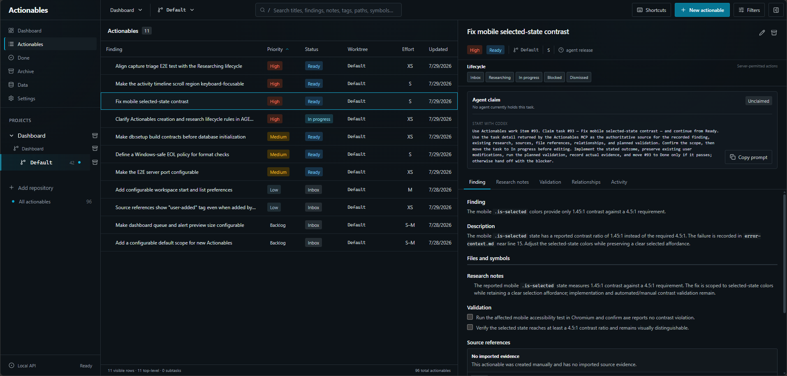

# Actionables

> Give Codex a persistent, evidence-backed execution queue.

Actionables is a local, single-user Windows companion for Codex. It turns
findings from reviews, audits, and investigations into scoped work that Codex
can research, claim, implement, and validate. The original evidence, decisions,
dependencies, and activity history stay attached to each item across Codex
tasks instead of disappearing into chat history or a flat to-do list.

_The execution queue, lifecycle controls, recorded research and validation, and
built-in Codex handoff._

## What Actionables gives Codex

- A durable task record with priorities, intended outcomes, source references,
  file locations, research notes, and planned validation.
- Organize work by project, repository, and worktree, with nested
  scoped subtasks so Codex only discovers work from the selected feature or bug.
- An explicit lifecycle—`Inbox` → `Researching` → `Ready` → `In progress` →
  `Done`—with blocked and dismissed states.
- Ownership claims, dependencies, validation requirements, handoff context, and
  an auditable activity history.
- Dashboard queues, stale-work alerts, search, and include/exclude filters for
  deciding what should be handed to Codex next.
- Archive completed scopes and restore them later.
- Let Codex create and coordinate scoped tasks through an authenticated,
  loopback-only MCP endpoint.

## Documentation

- **[How-to guide](docs/how-to.md)** — navigate the dashboard, organize work,
  manage settings, and hand tasks to Codex.
- [Windows setup and local operation](docs/windows-setup.md) — install, run,
  troubleshoot, and verify Actionables.
- [Connect Codex through MCP](docs/mcp-agent-tasks.md) — token setup,
  configuration, and the agent workflow.
- [Local data and historical backups](docs/backup-restore.md) — storage and
  recovery limitations.
- [Runtime and browser support](docs/support-policy.md) — verified versions and
  platforms.
- [Release verification](docs/release-verification.md) and
  [accessibility audit](docs/accessibility-audit.md) — validation reports.

## Requirements

- 64-bit Windows
- Node.js `>=22.19.0 <25` (`24.18.0` is the intended runtime)
- pnpm `11.9.0`
- PowerShell 7
- Current Microsoft Edge or Google Chrome

See the [support policy](docs/support-policy.md) for the versions verified by
the project.

## Current scope

Actionables is deliberately focused on local execution coordination. It does
not provide user accounts, team collaboration, notifications, cloud sync,
hosted deployment, Git operations, automatic relationship changes, or generic
project-management features.

The supported deployment remains local and single-user. There is currently no
installer, updater, published binary, hosted service, or supported non-Windows
deployment.
